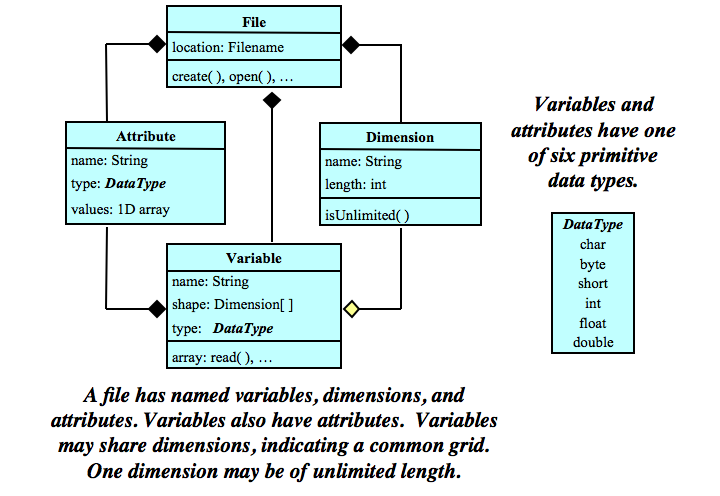

CF-NetCDF as reference data model for VW
========================================

Intro
-----

In this project we want to collect mutually relevant data from WC-WAVE
researchers that will be discoverable as a first step to being usable by
other WC-WAVE researchers for whatever model they choose. In short, this 
necessitated the choice of a data model. The NetCDF data model itself is 
sensible and implemented in common programming languages, but it also offers
web-based tools (a RESTful API?) for selecting and downloading only subsets of 
data on disk. Since NetCDF knows how to slice by loading selectively from disk,
the user does not have to load everything into memory before slicing.

NetCDF is intended as a self-describing data format. In other words, it contains
its own metadata. The Climate and Forecast (CF) conventions provide a common
guiding framework for writing this metadata, so that other any researcher 
following the CF standard can easily share or process thiers or others' data
with a common set of tools like 
`cfplot <http://www.met.reading.ac.uk/~andy/cfplot_sphinx/_build/html/>`_.
CF has the canonical documentation on its standard on its organization page:
`http://cfconventions.org/documents.html 
<http://cfconventions.org/documents.html>`_.

Although necessary for creating a cutting-edge toolset for hydrological
modeling, all this infrastructure comes with some conceptual overhead. Here is
some background on the CF-NetCDF format.

Resources for Understanding NetCDF(-python)
-------------------------------------------

Because Python seems to be the most widely used language in our project, we will
be using and supporting the `NetCDF-python API <https://github.com/Unidata/netcdf4-python>`_.

Probably the best way to quickly get a feel for NetCDF, model and Python
interface, is to see these two python notebooks by the creator of the
NetCDF-python API: `reading_netCDF.ipynb <http://nbviewer.ipython.org/github/Unidata/netcdf4-python/blob/master/examples/reading_netCDF.ipynb>`_ 
and 
`writing_netCDF.ipynb <http://nbviewer.ipython.org/github/Unidata/netcdf4-python/blob/master/examples/writing_netCDF.ipynb>`_.

Also, have a look at the basic data model for NetCDF files:

   Classic Data Model

Taken from `UNIDATA
site <http://www.unidata.ucar.edu/software/netcdf/docs/html_tutorial/nc-classic-uml.png>`_.
There are some important things to note so we are speaking the same language.
First, a ``Dataset`` is a *container* for ``dimensions``, ``variables``, and
``attributes``, themselves containers for their data and metadata about 
themselves or the ``Dataset``. The next part will require the basic understanding 
gained from working through the above ipynb's. 

Example 1: Create a NetCDF of temperature on a grid
---------------------------------------------------

In overly simple terms we use NetCDF to represent data as a function of some
coordinates, like a grid of longitude and latitude values. Here's how we'd
create a NetCDF of some temperatures on a 3x3 grid:

.. code-block:: python
    
    # TODO solve this using mix of CF examples from App H and NetCDF tutorial

Example 2: Create a CF-formatted NetCDF of temperature at weather stations
------------------------------------------------------------------------

Consider the following situation: You have 
weather stations named ``s1``, ``s2``, and ``s3`` recording the temperature at
three-dimensional points in space (x,y,z), which correspond to a longitude, 
latitude, and altitutde. How would we represent data where each station 
recorded data at the exact same time?

We can consult the examples in the CF Conventions Manual in `Appendix H <http://cfconventions.org/Data/cf-conventions/cf-conventions-1.7/build/aph.html>`_ for guidance. We will essentially implement 
a customized version of `H1 <http://cfconventions.org/Data/cf-conventions/cf-conventions-1.7/build/aph.html#idm482625503680>`_ 
without the time dimension.

Solution:

.. code-block:: python
    
    # TODO solve this using mix of CF examples from App H and NetCDF tutorial

Example 3: CF-NetCDF of timeseries of temperatures at weather stations
----------------------------------------------------------------------

.. code-block:: python
    
    # TODO solve this using mix of CF examples from App H and NetCDF tutorial
